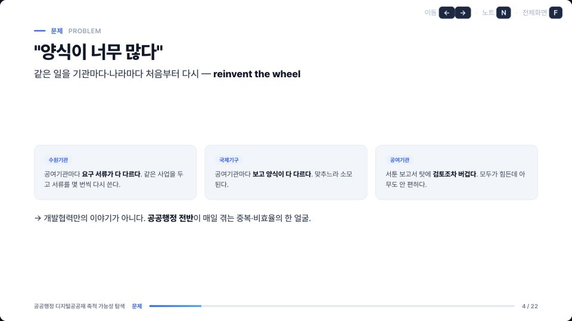
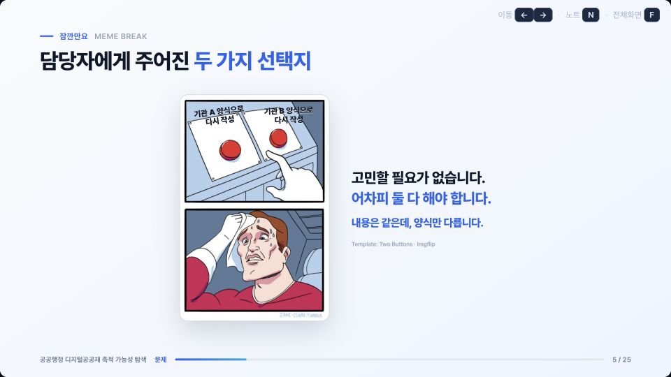
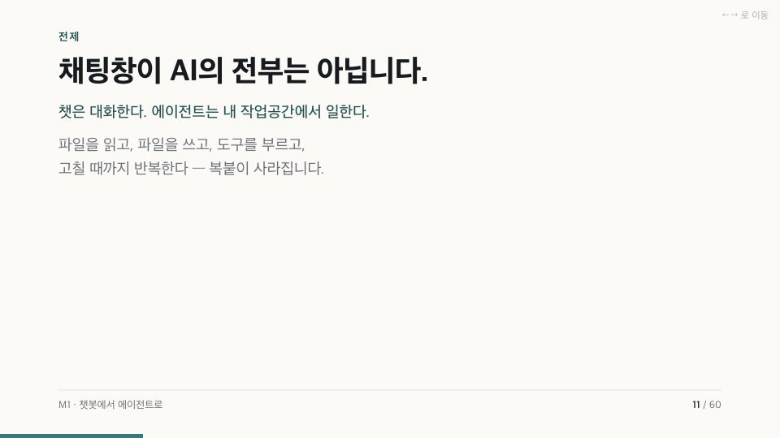
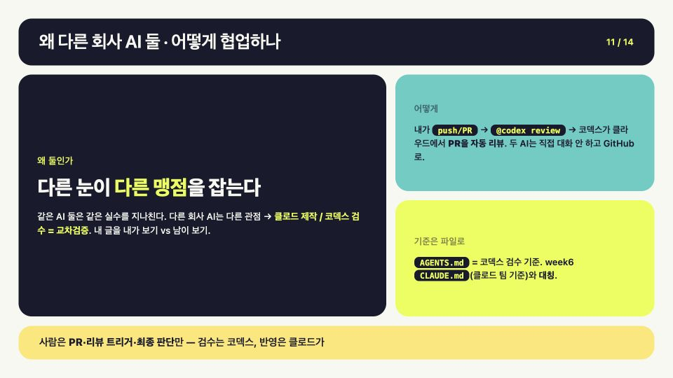
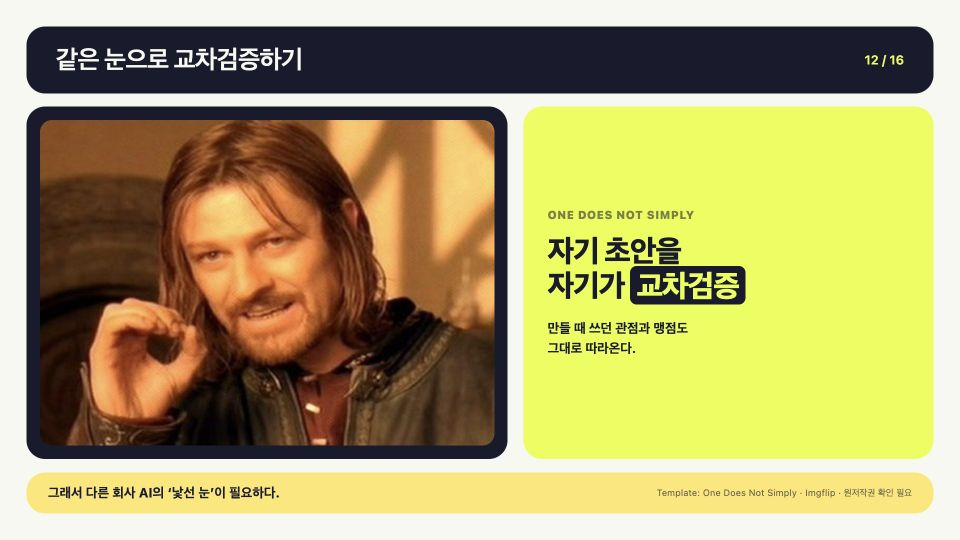

# Slide Meme Inserter

HTML 슬라이드를 기획·생성하거나 기존 덱을 후처리하면서, 맥락과 청중에 맞는 유명 밈을 절제해 삽입하는 Codex 스킬입니다.

Claude Code와 Codex가 동일한 `SKILL.md`를 사용합니다. 제품별 매니페스트만 분리되어 있어 기능과 규칙이 서로 어긋나지 않습니다.

## 최근 변경

- 한국 밈 정적 이미지 출처 계층과 사용자 제공 이미지 대안을 추가했습니다.
- 특정 유명 밈의 반복 선택을 줄이는 다양성 기준을 추가했습니다.
- 외부·공유·녹화에는 `strict`, 일회성 사내 현장 발표에는 제한된 `practical` 권리 모드를 제공합니다.
- 실제 밈을 적용한 저해상도 전후 사례와 출처·이용 판단 기록을 복원했습니다.

전체 변경 내역은 [CHANGELOG.md](CHANGELOG.md)를 참고하세요.

## 왜 만들었나

AI로 HTML 슬라이드를 만들기 시작하면서 PPT를 직접 만드는 일은 거의 사라졌습니다. 내용 구성도, 디자인도, 수정 속도도 만족스러웠지만 한 가지가 아쉬웠습니다. 발표에서 **나만의 웃음 코드가 사라졌습니다.**

완성된 HTML을 직접 고쳐 밈을 넣을 수는 있습니다. 하지만 사람 마음이 그렇듯, 한 번 귀찮아지면 “이번에는 그냥 빼자”가 되기 쉽습니다. 발표는 매끈해졌지만 점점 덜 나다워졌습니다.

저는 아직 AI가 인간을 따라오지 못하는 영역 중 하나가 **유머**라고 생각합니다. 그래서 AI에게 새로운 농담을 창작시키기보다, 사람들이 이미 알아보는 유명 밈을 넓게 찾고 발표의 맥락·타이밍·청중에 맞춰 제안하고 삽입하도록 이 스킬을 만들었습니다. 최종 웃음 코드와 판단은 여전히 사람의 몫입니다.

## 사용 전후

스킬은 기존 논리와 디자인을 억지로 밈으로 바꾸지 않습니다. 왼쪽의 문제 제시 슬라이드를 그대로 보존하고, 가장 효과적인 지점에 오른쪽과 같은 짧은 밈 브레이크를 추가합니다.

### 사례 1 — 반복 업무의 딜레마

| 사용 전 — 내용은 명확하지만 호흡이 없음 | 사용 후 — 공감되는 유명 밈으로 메시지를 회수 |
|---|---|
|  |  |

이 예시에서는 `Two Buttons`의 익숙한 딜레마 문법을 사용해 “내용은 같은데 양식만 다르다”는 문제를 한눈에 기억하게 만듭니다. 원래 콘텐츠는 삭제하거나 축약하지 않았습니다.

### 사례 2 — 챗봇과 에이전트의 차이

| 사용 전 — 개념 차이를 문장으로 설명 | 사용 후 — 익숙한 오인 밈으로 개념을 각인 |
|---|---|
|  |  |

`Is This a Pigeon?`의 “잘못 알아보기” 문법을 사용해 “ChatGPT 채팅창이 곧 에이전트인가?”라는 교육 현장의 흔한 오해를 짧은 질문으로 바꿉니다. 다음 실습으로 넘어가기 전에 청중의 개념을 맞추는 `reaction` 역할입니다.

### 사례 3 — 같은 AI가 자기 작업을 검수할 때

| 사용 전 — 이종 AI 교차검증의 필요성을 설명 | 사용 후 — 불가능에 가까운 자기검수를 밈으로 회수 |
|---|---|
|  |  |

`One Does Not Simply`의 “말처럼 간단하지 않다”는 문법을 사용해 자기검수의 한계를 회수합니다. 원래 협업 방식 설명은 보존하고, 회고 슬라이드로 넘어가기 직전에 `analogy` 역할의 밈 슬라이드를 추가했습니다.

> **예시 이미지 이용 기록.** 이 파일들은 밈 원본이나 빈 템플릿을 제공하기 위한 것이 아니라, 스킬의 적용 전후와 밈 문법을 설명·비평하는 960×540 슬라이드 화면입니다. 필요한 장면을 슬라이드 구성의 일부로만 사용하고 원본 시장을 대체하지 않는다고 판단하여 `strict` 모드에서 대한민국 저작권법 제28조와 제35조의5의 판단 요소를 검토했으며, 제37조에 따라 아래와 같이 출처를 표시합니다.
>
> - 템플릿·제작 도구: [Two Buttons](https://imgflip.com/meme/Two-Buttons), [Is This a Pigeon?](https://imgflip.com/meme/Is-This-A-Pigeon), [One Does Not Simply](https://imgflip.com/memetemplate/One-Does-Not-Simply) · Imgflip
> - 형식·유래 확인: [Daily Struggle / Two Buttons](https://knowyourmeme.com/memes/daily-struggle-two-buttons), [Is This a Pigeon?](https://knowyourmeme.com/memes/is-this-a-pigeon), [One Does Not Simply Walk into Mordor](https://knowyourmeme.com/memes/one-does-not-simply-walk-into-mordor) · Know Your Meme
> - 법적 판단 기준: [저작권법 제28조·제35조의5·제37조](https://www.law.go.kr/법령/저작권법)
>
> 출처 표시만으로 이용허락이 생기는 것은 아니며, 예외 적용 여부는 구체적인 이용 맥락에 따라 달라집니다. 위 슬라이드에 포함된 제3자 이미지 요소에는 저장소의 MIT 라이선스가 적용되지 않습니다. 권리자가 수정이나 삭제를 요청하려면 [GitHub 이슈](https://github.com/amnotyoung/slide-meme-inserter/issues)를 이용해 주세요.

## 설치

### Claude Code

```text
/plugin marketplace add amnotyoung/slide-meme-inserter
/plugin install slide-meme-inserter@slide-meme-inserter
```

### Codex

Codex에 다음과 같이 요청할 수 있습니다.

```text
Install the insert-slide-memes skill from
https://github.com/amnotyoung/slide-meme-inserter
```

수동 설치 시 저장소의 `skills/insert-slide-memes` 폴더를 Codex 스킬 디렉터리에 복사합니다.

## 두 종류의 모드

이 스킬에는 서로 독립적인 **워크플로 모드**와 **권리 모드**가 있습니다.

### 워크플로 모드

- `postprocess`: 완성된 HTML의 논리와 디자인을 보존하며 밈을 삽입하거나 교체합니다.
- `plan-and-build`: 슬라이드 기획부터 밈의 역할·위치·후보·캡션을 함께 설계하고 HTML을 생성합니다.

사용자가 모드를 지정하면 그대로 따릅니다. 지정하지 않으면 기존 HTML이 있는 경우 `postprocess`, 주제·자료·구성안에서 새 덱을 만드는 경우 `plan-and-build`를 선택합니다.

### 권리 모드

| 사용 상황 | `rights_mode` | 계획의 `use_modes` | `distribution` | 요구 사항 |
|---|---|---|---|---|
| 녹화·배포 없는 일회성 사내 현장 발표 | `practical` 또는 `strict` | `live-internal` | `internal` | practical 간이 위험심사 또는 strict 법적 근거 |
| 사내 파일 공유 | `strict` | `internal-file-share` | `internal` | 해당 공유 범위를 포괄하는 법적 근거 |
| 고객 대상 현장 발표 | `strict` | `live-client` | `external-limited` | 고객 발표 범위를 포괄하는 법적 근거 |
| 제한된 외부 파일 전달 | `strict` | `external-file-share` | `external-limited` | 외부 전달 범위를 포괄하는 법적 근거 |
| 유료 행사 | `strict` | `paid-event` | `external-limited` | 상업적 이용을 포함하는 법적 근거 |
| 공개 PDF·녹화·온라인 게시 | `strict` | `public-pdf`, `public-recording`, `online-publication` | `public` | 해당 공개 범위를 포괄하는 법적 근거 |

한 덱을 여러 방식으로 사용할 예정이라면 해당하는 `use_modes`를 모두 기록하고, 가장 넓은 범위에 맞춰 `distribution`을 정합니다.

`strict`은 기본값입니다. 사용 맥락이 불명확하거나 파일 공유·고객·유료·내보내기·녹화·공개 가능성이 있으면 `strict`을 사용합니다.

`practical`은 `distribution: internal`인 일회성 `live-internal` 발표에만 사용할 수 있습니다. 맥락적 변용, 필요한 분량과 해상도, 시장 대체성, 저작인격권·초상 위험, 출처 위치와 `no_recording_or_distribution: true`를 기록해야 합니다. 검색 후보의 `scores.safety_rights`는 완전한 권리 정리가 아니라 제한된 위험심사임을 나타내도록 `1`로 기록합니다.

`practical`은 적법성을 보증하거나 법정 예외를 선언하는 모드가 아닙니다. 사용 범위가 넓어지면 기존 `practical-reviewed` 상태를 승계하지 않고 전체 계획을 `strict`으로 다시 심사합니다.

향후 파일 전달이나 공개가 **현재 계획에 이미 포함되어 있다면** practical을 거치지 않고 처음부터 `strict`을 선택합니다. 예를 들어 사내 현장 발표 후 외부 참석자에게 PDF를 보낼 예정이라면 `use_modes`에 `live-internal`과 `external-file-share`를 모두 기록하고, 법적 근거의 범위도 두 사용을 모두 포괄해야 합니다. practical 발표가 끝난 뒤 예상하지 못했던 배포 요구가 새로 생긴 경우에만 그 시점에 strict 계획으로 전환하고 새 사용 범위를 추가합니다.

> 명령행의 `--strict` 옵션은 경고도 실패로 처리하는 **감사기 실행 옵션**입니다. 계획의 `rights_mode: "strict"`과는 별개입니다.

## 빠른 사용 예시

기존 HTML에 밈을 넣는 경우:

```text
Use $insert-slide-memes in postprocess mode.
Use practical rights mode: this is a one-off internal live talk,
with no recording, export, or file sharing.
Add the supplied meme to slides.html.
```

새 덱을 기획하면서 공개 PDF까지 만들 경우:

```text
Use $insert-slide-memes in plan-and-build mode.
Use strict rights mode because the final deck will be published as a PDF.
Plan restrained meme beats and build the HTML deck.
```

사용자가 직접 제공한 이미지·URL·템플릿명·캡션·희망 위치는 두 워크플로 모드에서 모두 우선 보존합니다. 비어 있는 항목만 문맥에 맞게 보완하며, 사용자 제공 자체를 이용허락으로 간주하지 않습니다.

## 계획의 권리 필드

실행 가능한 JSON 계획은 루트에 `rights_mode`를 기록합니다. 아래는 practical 배치에서 권리 관련 필드만 발췌한 예시이며, 이것만으로는 전체 계획 감사를 통과하지 않습니다. 전체 배치 스키마는 [`plan-and-build.md`](skills/insert-slide-memes/references/plan-and-build.md)를 참고하세요.

```json
{
  "plan_version": 1,
  "audience": "사내 교육 참석자",
  "rights_mode": "practical",
  "placements": [
    {
      "id": "m01",
      "status": "selected",
      "rights_status": "practical-reviewed",
      "distribution": "internal",
      "use_modes": ["live-internal"],
      "attribution_location": "speaker-notes",
      "practical_review": {
        "transformative_context": "팀의 업무 실패를 설명하는 반응 이미지로 사용",
        "necessity": "해당 논점을 설명하는 한 장면에 한 번만 사용",
        "amount_resolution": "저해상도 이미지 전체를 크롭 없이 사용",
        "market_substitution": "원저작물 수요를 대체하지 않음",
        "moral_personality_risk": "비하·왜곡·보증 암시 및 민감 인물 위험 없음",
        "attribution_method": "speaker-notes",
        "checked_at": "2026-07-25",
        "no_recording_or_distribution": true
      }
    }
  ]
}
```

권리 상태의 전환은 다음과 같습니다.

- 미심사 사용자 이미지: `status: provisional`, `rights_status: user-provided-unverified`
- practical 심사 통과: `status: selected`, `rights_status: practical-reviewed`
- 라이선스·허락·퍼블릭도메인 확인: `status: selected`, `rights_status: cleared`
- 법정 예외 검토 완료: `status: selected`, `rights_status: exception-reviewed`

`unclear` 또는 `user-provided-unverified` 상태인 이미지는 어떤 권리 모드에서도 바로 `selected`로 사용할 수 없습니다.

## 출처 위치

- `strict`: `on-slide` 또는 `credits-slide`
- `practical`: `on-slide`, `credits-slide` 또는 `speaker-notes`

`on-slide` 출처는 해당 `.slide-meme` figure 안에 둡니다. `credits-slide`는 `credits`, `credits-slide`, `references`, `sources` 중 하나의 클래스를 가진 슬라이드에 둡니다. `speaker-notes`는 `speaker-notes` 클래스 또는 `data-speaker-notes` 속성을 가진 요소에 둡니다. figure 밖의 출처 링크에는 `data-meme-plan-id`와 `data-meme-attribution-location`을 기록해야 하며, HTML 감사기가 실제 컨테이너와 계획을 대조합니다.

## 한국 밈 검색의 한계와 대안

한국 밈은 후보명, 의미, 유래와 원영상·원게시물까지 찾을 수 있어도 발표에 바로 삽입할 이미지 파일을 안정적으로 확보하기 어렵습니다.

- Imgflip처럼 템플릿과 원본 이미지가 한곳에 정리된 대표 저장소가 없습니다.
- 검색 결과의 상당수가 커뮤니티 재게시물, 방송·유튜브 캡처 또는 출처가 잘린 이미지입니다.
- 방송사 VOD나 제작자 영상을 찾았더라도 특정 화면을 재사용할 권리가 자동으로 생기지는 않습니다.
- `strict`에서는 원출처 또는 법적 이용 근거를 확인하지 못한 후보가 `provisional` 상태에 머뭅니다.
- `practical`에서는 일회성 사내 현장 발표에 한해 간이 위험심사를 통과한 후보를 `practical-reviewed`로 전환할 수 있습니다.

`strict`에서 가장 확실한 대안은 **사용자가 권리 근거가 확인된 이미지 파일과 허락·라이선스 정보를 함께 제공하는 것**입니다. 예를 들어:

```text
my-deck/
├── slides.html
└── meme-input/
    ├── operation-later.jpg
    └── move-on.png
```

Claude Code 또는 Codex에는 다음처럼 요청합니다.

```text
Use $insert-slide-memes to add memes to slides.html.

- ./meme-input/operation-later.jpg
  - 위치: 운영과 유지보수 섹션 앞
  - 캡션: "운영 담당은… 다음에 정하죠."
- ./meme-input/move-on.png
  - 위치: 실패한 실습 결과 다음
  - 캡션: "이 결과는 넘어갈게요."
```

파일명과 위치만 줘도 스킬이 문맥에 맞는 배치를 제안할 수 있습니다. 더 정확한 처리를 원하면 이미지마다 다음 정보를 함께 제공합니다.

- 원본을 찾은 페이지 또는 제작자 URL
- 원하는 슬라이드나 섹션
- 사용할 캡션
- 내부 교육용인지 공개 배포용인지
- 알고 있는 라이선스 또는 사용 허가

선택한 권리 모드의 심사를 통과하면 스킬은 제공된 원본 파일을 보존하고, 최종 덱의 `assets/memes/` 아래에 ASCII 파일명으로 복사하거나 단일 HTML 요청 시 Base64로 포함합니다. 아직 심사하지 않은 이미지는 `user-provided-unverified`와 `provisional`로 기록합니다.

### 한국 밈은 정적 이미지로 가져옵니다

한국 밈은 먼저 밈 형식·의미·청중 인지도·발표자 정체성 위험을 심사합니다. 이 게이트를 모두 통과한 후보만 정적 이미지를 찾습니다. 영상에서 장면을 찾고 캡처하지 않습니다.

1. 정확한 대사나 후보명에 `짤`, `이미지`, `PNG`, `JPG`를 붙여 이미지 검색합니다.
2. 검색 썸네일이 아니라 해당 페이지에 포함된 실제 정적 이미지 URL을 찾습니다.
3. 이미지가 실제 밈 템플릿인지 확인합니다. 문구만 연상되는 월페이퍼·홍보 이미지·팬덤 이미지는 탈락시킵니다.
4. `strict`라면 라이선스·허락·퍼블릭도메인 또는 적용 법령상 예외 근거를 확인하고, `practical`이라면 제한된 사내 현장 사용 위험심사를 완료합니다.
5. 현장 발표, 파일 공유, 고객 발표, 유료 행사, PDF 공개, 녹화, 온라인 게시 범위를 구분해 기록합니다.
6. 계획 감사를 통과한 뒤에만 JPG·PNG·WebP·GIF 파일을 내려받고 크기와 내용을 확인합니다.
7. 의미 출처, 원출처, 이미지 URL, 모드별 심사, 출처 위치와 추가 권리 검토를 분리해 기록합니다.
8. 선택한 권리 모드를 통과하지 못하면 영상 캡처나 사용자 제공 파일로 우회하지 않고 후보를 보류하거나 교체합니다.

사용자가 이미 원하는 짤을 알고 있다면 이미지와 함께 권리자·라이선스·허락 범위·출처 URL을 제공하는 방식이 가장 빠르고 정확합니다. 단순히 파일만 전달받았다는 이유로 선택 상태로 전환하지 않으며, `strict` 법적 근거나 `practical` 간이 위험심사가 별도로 필요합니다.

## 권리 확인

`strict`의 `selected` 상태에는 다음 중 하나가 필요합니다.

- 라이선스
- 개별 이용허락
- 퍼블릭도메인 근거
- 대한민국 저작권법 제28조 인용, 제35조의5 공정이용 또는 제25조 학교교육 목적 이용에 대한 구체적 검토

`practical`의 `selected` 상태에는 일회성 `live-internal`, 내부 배포, 무녹화·무배포 확인과 간이 위험심사가 필요합니다. 스킬은 사용 범위와 심사 필드의 존재를 감사하지만 법률 의견이나 법원의 판단을 대신하지 않습니다.

각 근거와 심사의 전체 필드는 [`rights-clearance.md`](skills/insert-slide-memes/references/rights-clearance.md)를 참고하세요.

## 원칙

- 오리지널 밈보다 청중이 바로 알아보는 기존 밈을 우선합니다.
- 언어권을 제한하지 않고 문맥 적합성과 인지도를 기준으로 선택합니다.
- 월페이퍼·홍보 이미지·팬덤 이미지는 문구가 맞더라도 검색 밈으로 사용하지 않습니다.
- 게임·스포츠·정치 등 발표자의 취향이나 정체성을 암시하는 후보는 청중 근거와 사용자 승인이 없으면 탈락시킵니다.
- 점수 합계 전에 필수 게이트를 적용하며, 적합한 후보가 없으면 밈을 넣지 않습니다.
- 밈은 논리를 대신하지 않고 반응, 비유, 콜백, 전환을 돕습니다.
- 전체 최대 개수는 고정하지 않습니다. 발표 톤과 콘텐츠 길이에 따른 밀도를 소프트 상한으로 사용하고, 밈 사이에는 보통 콘텐츠 슬라이드 5장 이상의 간격을 둡니다.
- 이미지 출처만으로 허락을 추정하지 않으며 계획의 `strict` 또는 `practical` 심사를 요구합니다.
- 현장 상영, 사내 공유, 고객 발표, 유료 행사, PDF, 녹화와 온라인 게시의 허락 범위를 각각 확인합니다.
- 저작인격권, 초상·퍼블리시티와 상표 위험을 별도로 검토합니다.
- 삽입 전 계획 감사, 삽입 후 HTML 대조와 실제 브라우저 렌더링을 모두 검증합니다.

## 구조

```text
skills/insert-slide-memes/
├── SKILL.md
├── agents/openai.yaml
├── references/
│   ├── meme-playbook.md
│   ├── plan-and-build.md
│   ├── rights-clearance.md
│   └── user-provided-memes.md
└── scripts/
    ├── audit_meme_plan.py
    └── audit_memes.py
```

생성된 덱과 내려받은 이미지, QA 캡처는 `output/`에 두며 Git에는 포함하지 않습니다.

제품별 배포 메타데이터:

```text
.claude-plugin/  # Claude Code
.codex-plugin/   # Codex
```

## 감사

계획 감사는 모드·상태·사용 범위·심사 필드를 확인하고, HTML 감사는 계획 ID·이미지·접근성·출처 링크와 실제 출처 컨테이너를 대조합니다.

```bash
python3 skills/insert-slide-memes/scripts/audit_meme_plan.py path/to/meme-plan.json --strict
python3 skills/insert-slide-memes/scripts/audit_memes.py \
  path/to/deck.html --plan path/to/meme-plan.json --strict
python3 -m unittest discover -s tests -v
```

## 라이선스

MIT. 템플릿명과 설명은 제3자 밈 이미지에 대한 이용허락을 부여하지 않습니다.
